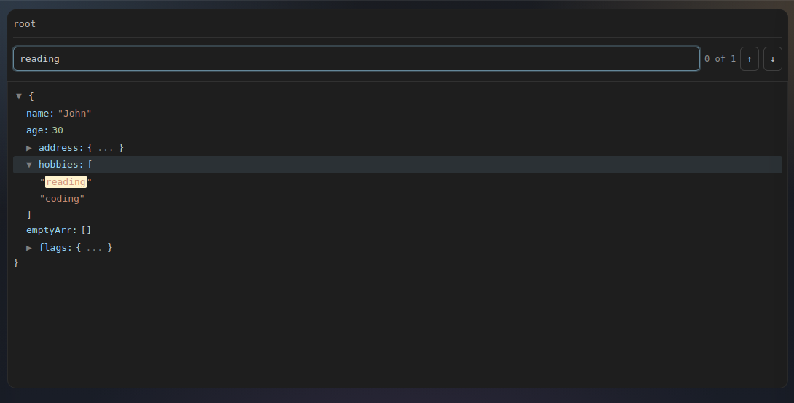
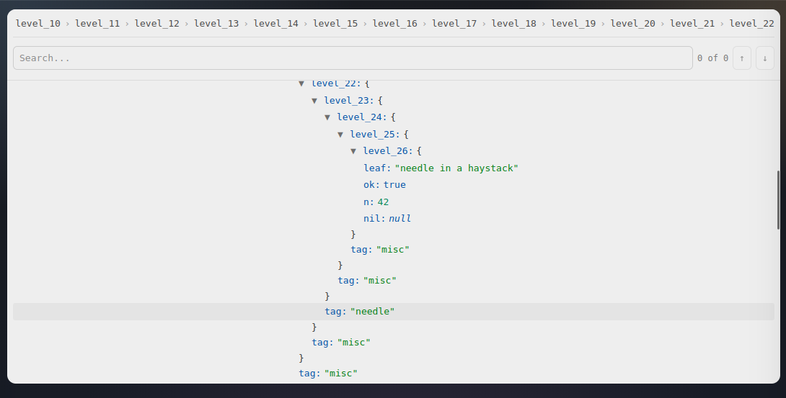

# react-json-treeview

A lightweight, performant React JSON tree viewer with search, navigation, and sticky breadcrumbs.

[](https://www.npmjs.com/package/@luismvl/react-json-treeview)
[](https://github.com/luismvl/react-json-treeview/actions/workflows/ci.yml)

[**Live Playground**](https://luismvl.github.io/react-json-treeview/) · Status: stable (`1.x`) (current repo version: `1.0.0`).




## Features

- Expand/collapse objects and arrays
- Syntax highlighting for JSON types
- Search with next/previous match navigation
- Sticky breadcrumb that tracks scroll position
- Keyboard navigation (tree + search)
- Imperative ref API (expand/collapse/scroll/search navigation)
- TypeScript types included
- No runtime dependencies (React as peer dependency)

## Installation

```bash
npm install @luismvl/react-json-treeview
# or
pnpm add @luismvl/react-json-treeview
# or
yarn add @luismvl/react-json-treeview
```

Peer dependencies: `react` and `react-dom` (React 18 or 19).

## Quick Start

```tsx
import { JsonTreeView } from '@luismvl/react-json-treeview'
import '@luismvl/react-json-treeview/styles.css'

function App() {
    const data = {
        name: 'John',
        age: 30,
        address: {
            city: 'New York',
            zip: '10001',
        },
    }

    return <JsonTreeView data={data} />
}
```

## API

### Props

All props from `JsonTreeViewProps`:

| Prop                  | Type                                                                                                                                | Default    | Description                                                                     |
| --------------------- | ----------------------------------------------------------------------------------------------------------------------------------- | ---------- | ------------------------------------------------------------------------------- |
| `data`                | `JsonValue`                                                                                                                         | (required) | JSON data to render                                                             |
| `defaultExpanded`     | `boolean`                                                                                                                           | `true`     | Start with all expandable nodes expanded                                        |
| `theme`               | `'light' \| 'dark' \| 'auto'`                                                                                                       | `'auto'`   | Color theme (`auto` follows system preference)                                  |
| `className`           | `string`                                                                                                                            | -          | Additional class on the root element                                            |
| `searchable`          | `boolean`                                                                                                                           | `true`     | Show the built-in search UI                                                     |
| `showBreadcrumb`      | `boolean`                                                                                                                           | `true`     | Show the sticky breadcrumb                                                      |
| `indentSize`          | `number`                                                                                                                            | `20`       | Indentation per depth level, in pixels                                          |
| `fontSize`            | `number`                                                                                                                            | `13`       | Font size, in pixels                                                            |
| `onNodeClick`         | `(path: string[],`<br>`value: JsonValue)`<br>`=> void`                                                                              | -          | Called when a row is clicked                                                    |
| `onSearchChange`      | `(query: string,`<br>`matches: SearchMatch[])`<br>`=> void`                                                                         | -          | Called when search query/matches change                                         |
| `externalSearchQuery` | `string`                                                                                                                            | -          | Controlled search query (disables editing in the built-in input)                |
| `renderValue`         | `(value: JsonPrimitive,`<br>`path: string[],`<br>`type: JsonPrimitiveType,`<br>`ctx: RenderValueContext)`<br>`=> ReactNode \| null` | -          | Custom rendering for primitive leaf values; return `null` for default rendering |

Notes:

- `path` uses object keys and array indices (as strings). Root is `[]`.
- Search navigation (next/previous) expands parents and scrolls to the match.
- `ctx.defaultRenderer()` preserves built-in rendering (including search highlighting).

### Ref API

Use a ref for imperative control:

```tsx
import { useRef } from 'react'
import { JsonTreeView } from '@luismvl/react-json-treeview'
import type { JsonTreeViewRef } from '@luismvl/react-json-treeview'

const ref = useRef<JsonTreeViewRef>(null)

ref.current?.expandAll()
ref.current?.collapseAll()
ref.current?.scrollToPath(['address', 'city'])
ref.current?.focusSearch()
ref.current?.getExpandedPaths() // Set<string>
ref.current?.nextMatch()
ref.current?.previousMatch()
```

## Theming

Set `theme="light" | "dark" | "auto"` (default: `auto`). The component sets `data-theme` on the root element, and styles are implemented via CSS variables.

Available CSS variables (defaults shown for light theme):

| Variable                  | Purpose                              |
| ------------------------- | ------------------------------------ |
| `--js-font-family`        | Font family for the viewer           |
| `--jt-line-height`        | Line height                          |
| `--jt-bg-color`           | Background                           |
| `--jt-text-color`         | Default text                         |
| `--jt-key-color`          | Object keys                          |
| `--jt-string-color`       | String values                        |
| `--jt-number-color`       | Number values                        |
| `--jt-boolean-color`      | Boolean values                       |
| `--jt-null-color`         | Null values                          |
| `--jt-bracket-color`      | `{ }` and `[ ]`                      |
| `--jt-toggle-color`       | Expand/collapse toggles and ellipsis |
| `--jt-hover-bg`           | Row hover background                 |
| `--jt-highlight-bg`       | Search match highlight background    |
| `--jt-current-match-bg`   | Current match highlight background   |
| `--jt-current-match-ring` | Current match outline color          |

Example override:

```css
.react-json-treeview {
    --jt-bg-color: white;
    --jt-key-color: #0ea5e9;
    --jt-string-color: #10b981;
    --jt-number-color: #8b5cf6;
}
```

## Keyboard shortcuts

### Tree (when a row is focused)

| Shortcut                | Action                                                                  |
| ----------------------- | ----------------------------------------------------------------------- |
| `ArrowUp` / `ArrowDown` | Move focus to previous/next visible row                                 |
| `Home` / `End`          | Focus first/last visible row                                            |
| `Enter` / `Space`       | Expand/collapse the focused row (if expandable)                         |
| `ArrowRight`            | Expand the focused row (if collapsed)                                   |
| `ArrowLeft`             | Collapse the focused row (if expanded), otherwise focus parent          |
| `Ctrl+F` / `Cmd+F`      | Focus search input (only when the event starts inside the component)    |
| `Escape`                | Clear internal search query and focus search (uncontrolled search only) |

### Search input (when search UI is enabled)

| Shortcut      | Action                 |
| ------------- | ---------------------- |
| `Enter`       | Jump to next match     |
| `Shift+Enter` | Jump to previous match |
| `Escape`      | Clear query            |

## TypeScript

Type definitions are bundled with the package.

```ts
import type {
    JsonPrimitive,
    JsonPrimitiveType,
    JsonValue,
    RenderValueContext,
    RenderValueFn,
    SearchMatch,
    JsonTreeViewRef,
} from '@luismvl/react-json-treeview'
```

Custom value rendering with built-in highlighting:

```tsx
import { JsonTreeView, highlightText } from '@luismvl/react-json-treeview'
;<JsonTreeView
    data={data}
    renderValue={(value, path, type, ctx) => {
        if (type === 'string') {
            return <span title={ctx.pathKey}>{ctx.defaultRenderer()}</span>
        }

        // Example for fully custom rendering using exported helper:
        if (type === 'number') {
            return (
                <strong>
                    {highlightText(String(value), ctx.searchQuery, ctx.isCurrentValueMatch)}
                </strong>
            )
        }

        return null
    }}
/>
```

## Compatibility

| React Version | Status       |
| ------------- | ------------ |
| React 18.x    | ✅ Supported |
| React 19.x    | ✅ Supported |

**Note:** This library uses `forwardRef` for the imperative API to maintain compatibility with React 18. While `forwardRef` is deprecated in React 19 (in favor of `ref` as a prop), it remains fully functional. We will migrate to the new pattern when React 18 reaches end-of-life.

## License

MIT
